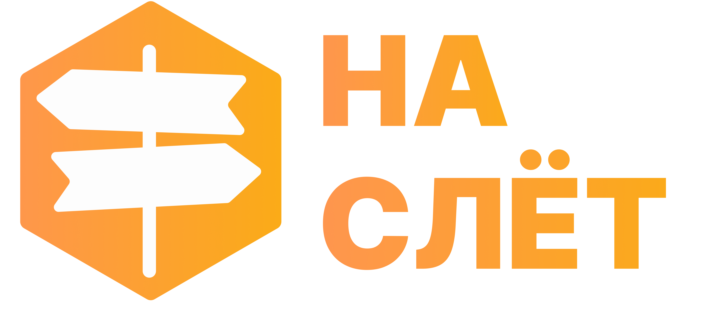
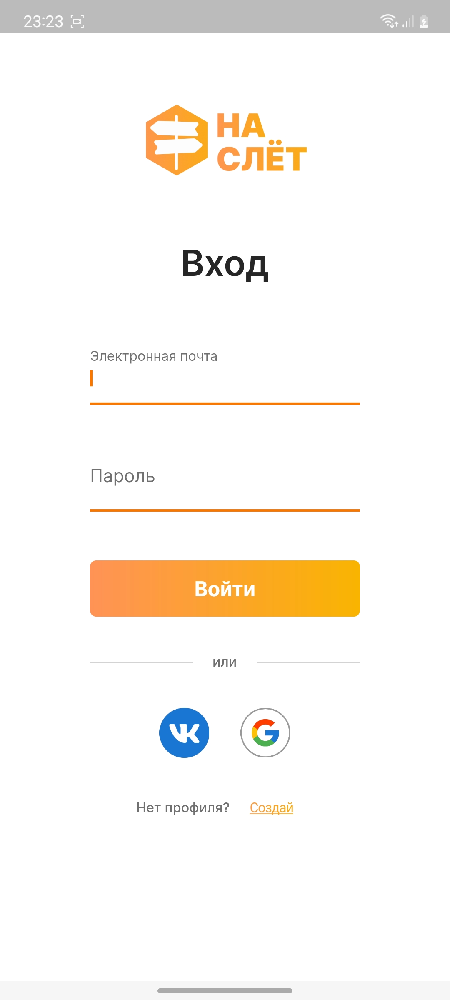
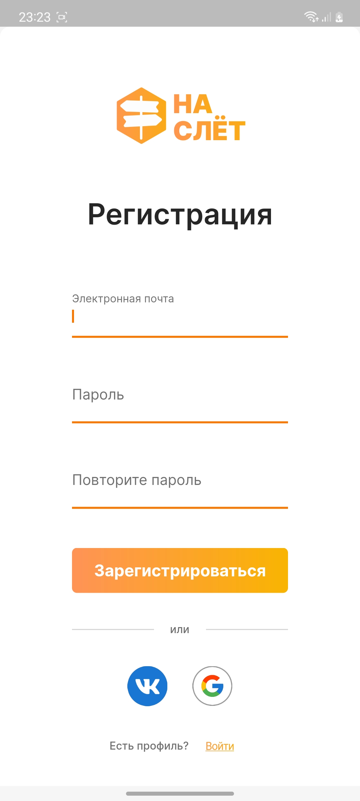
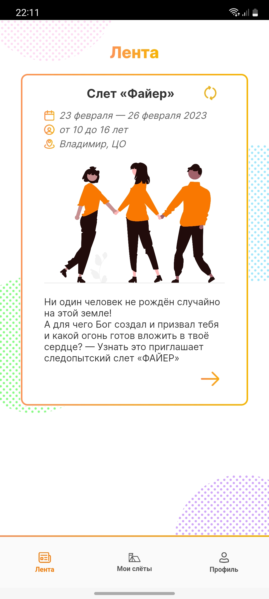
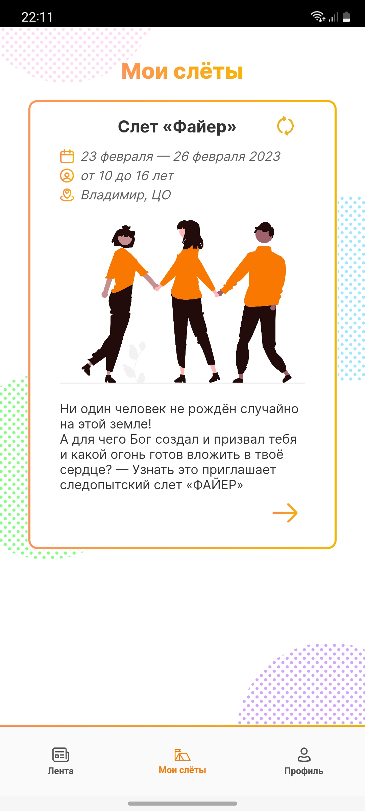
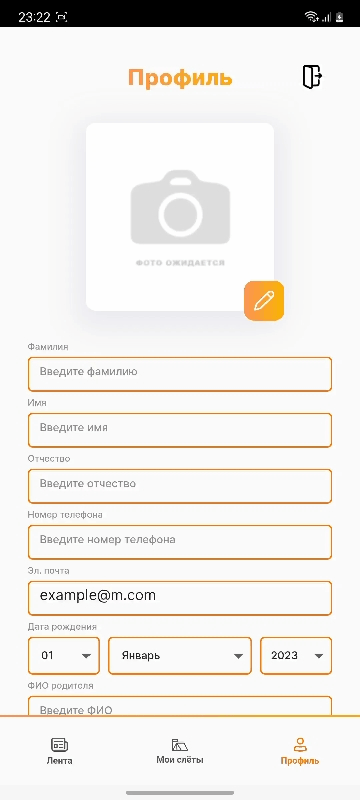

  

## About
🔸️NaSlet application is a tool that allows users to discover and attend various events happening in their area. 
🔸The application allows users to browse through a variety of events based on their interests and preferences. 
🔸Users can find information about the event's topic, cost, and location. 
🔸They can also respond to the invitation or purchase tickets directly through the app. 
🔸Additionally, the application  have features such as push notifications for upcoming events, the ability to create and share events. 
🔸The goal of the application is to make it easy for people to find and attend events that interest them. 

## Exploitation
🔹 Web  - https://naslet.ru  
🔹 Android  - [APK](https://drive.google.com/file/d/1hRmK9d6oSEIFHKYqpMOg9qAMl-6SoHBr/view?usp=drivesdk)

## Application Development

- *Vladislav Osin* - Team leader [@thevladoss](https://t.me/thevladoss)
- *Egor Mizyulin* - Mobile dev [@egormzln](https://t.me/egormzln)
- *Egor Golubev* - Backend dev [@Huscker](https://t.me/Huscker)
- *Veronika Molotkova* - Design [@onefad](https://t.me/onefad)

## Screenshots
Sign In                  | Sign Up       
:-------------------------:|:-------------------------:|
  |  

Feed          | My events                    
:-------------------------:|:-------------------------:
  |  

Detail Page                   | Map   | Profile         
:-------------------------:|:-------------------------:|:-------------------------:
  |   | 

## License

This application is released under GNU GPLv3 (see [LICENSE](LICENSE)).
Some of the used libraries are released under different licenses.
